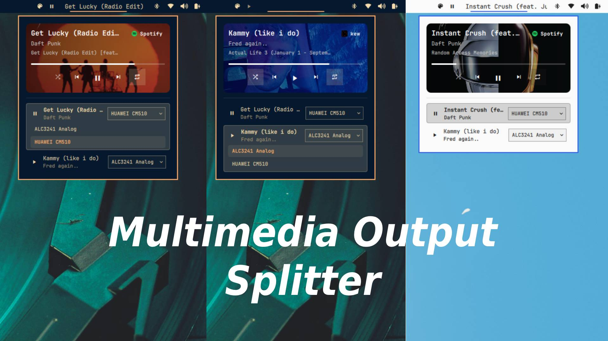

# Media Plus



Bar widget for Omarchy — a fork of `omarchy.media` with visual modifications and functionality enhancements: the classic MPRIS now-playing widget plus per-source audio routing and a **source badge** that shows which app the audio comes from and can jump straight to it.

## Features

- **Media Output**: choose a specific audio output for each media source independently. In the popup, every source row shows its current output and provides a menu to route that source to any available PipeWire sink without changing the other sources.
- **Now playing**: shows the current track title + artist in the bar, with a scrolling label for long titles.
- **Playback controls**: click to play/pause, middle-click (or scroll down) for next track, scroll up for previous track.
- **Popup card** (right-click): album art with rounded mask and gradient overlay, track title/artist/album, progress bar, and previous/play-pause/next buttons.
- **Multiple sources**: when several MPRIS players are around, the popup lists them with the active one highlighted; click a row to select it.
- **Source badge**: a pill in the popup's top-right corner showing the name of the audio source (e.g. `Spotify`, `kew`, `Chromium`) in white, with the app's logo next to it when the icon theme provides one. Clicking the badge **focuses the window** that is producing the audio.
- The badge always follows the media service's active player selection — paused players included — so it never disagrees with the highlighted source in the list. PipeWire playback streams are only used as a fallback when no MPRIS player exists (e.g. browser audio).

## Install

install in the bar:

```bash
omarchy plugin add https://github.com/MEPPERDONAS/omamedia-plus --enable
```

Move it if you want:

```bash
omarchy bar move famas.media-plus --section right
```

You can also validate it with:

```bash
omarchy plugin validate famas.media-plus
```

### Removing it

```bash
omarchy plugin remove famas.media-plus
```

That removes the plugin and its bar entry.

## Usage

- **Left click** — play/pause.
- **Right click** — open/close the popup card.
- **Middle click / scroll down** — next track.
- **Scroll up** — previous track.
- **Media Output** — in the popup, open the output selector on a source row and choose the sink that should receive that source's audio. The selector is available when multiple outputs are detected.
- **Popup top-right pill** — shows the audio source; click it to focus the source app's window (via `omarchy-hyprland-focus-app`, matching the Hyprland window class case-insensitively).

## Requirements

- Omarchy (shell `quickshell`).
- PipeWire sinks exposed through Quickshell for per-source audio routing.
- Font with Nerd Fonts icons for the playback glyphs.
- The `omarchy-hyprland-focus-app` command (included in Omarchy) for the source badge focus action.

## Customization

- Source detection and icon resolution live in `BarWidget.qml`: the `iconCandidates()` alias map (e.g. `spotify` → `spotify-client`) and `focusSource()` are the knobs for which icon name / window class is used.
- The badge style (colors, size, font) is the `sourceBadge` item inside the popup card.

## License

This project is licensed under the MIT License. See [LICENSE](LICENSE) for details.